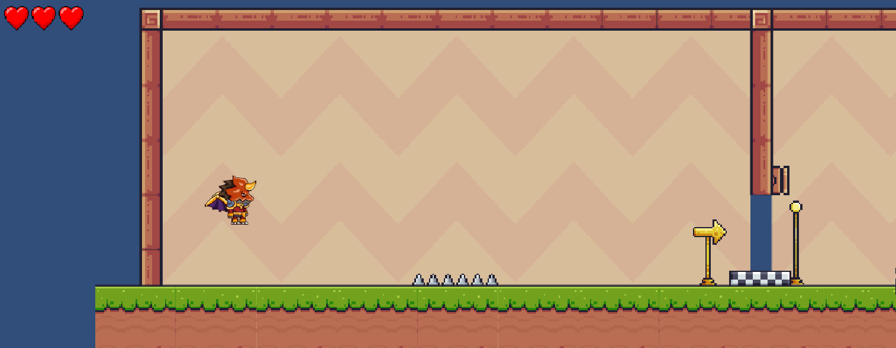

# Unity 2D Game Project

### Project Description
This is a 2D game developed using the Unity Engine. The project focuses on interactive gameplay mechanics, animations, scene management, and player controls. The game demonstrates practical implementation of Unity’s physics system, UI components, and scripting using C#.

## Technical Details
### Technologies/Components Used
For Software

Languages Used:
C#

Game Engine:
Unity

IDE Used:
Visual Studio Code (for scripting)

Version Control:
Git
GitHub

For Hardware
Main Components:
Laptop / PC

Keyboard & Mouse
Internet connection

Minimum Specifications:
OS: Windows 10 / 11
RAM: 8GB recommended
Storage: 5GB+ free space

### Implementation
For Software:
# Installation
git clone https://github.com/DeepasreeKannakykd/Unity-Project.git

# Run

Click Play ▶ inside the Unity Editor

Build the project via:
File → Build Settings → Build and Run

open  https://v0-terrible-fashion-advice.vercel.app/
to see the result

### Project Documentation

For Software:

# Screenshots 
 
The landing page of Style-Critic, a humorous AI-powered fashion app that offers intentionally bad style advice. Users can upload their outfit to receive terrible tips with the “Ruin My Style” button or browse chaotic fashion fails through “Explore Chaos.” Key features include Instant Disasters, Anti-Glow Up, and The Stage — all designed to help users look gloriously unfashionable.

 
# Diagrams
![Workflow]
Game flow from Start Menu → Gameplay → Score → Restart.

Made in Unity
